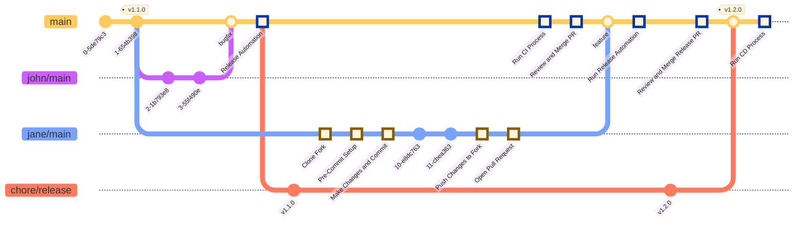

[](https://github.com/shinybrar/releaseer/actions/workflows/continous-integration.yaml) [](https://github.com/shinybrar/releaseer/actions/workflows/continous-deployment.yaml) [](https://codecov.io/gh/shinybrar/releaseer)

# Releaseer

This project aims to provide a walkthrough for best practices in release automation.

## Introduction

We use a set of tools and conventions to automate the release process. These tools and conventions are chosen to make the release process more efficient and less error-prone and work well with modern software development practices, such as Continuous Integration and Continuous Deployment (CI/CD). They build on top of each other to provide a seamless experience for developers, maintainers, and users.

**At its core, this release process uses commit messages to determine the impact of a change in the codebase. It then uses this information to drive the release process, such as generating changelogs, creating release branches, and tagging releases and creating pull requests for maintainers to review.**

## Conventions and Specifications

The conventions and specifications used in this release process are agnostic to the programming language, framework, or platform. They are based on the current best practices in the industry and are designed to be flexible and extensible. They can be adapted to fit the needs of any specific project or development team.

- [Conventional Commits](https://www.conventionalcommits.org/en/v1.0.0/), which is a specification for adding human and machine readable meaning to commit messages.
- [SemVer](https://semver.org), which is a specification for versioning software.
- [Changelog](https://keepachangelog.com/en/1.0.0/), which is a specification for maintaining the history of a project.
- [Continous Integration](https://en.wikipedia.org/wiki/Continuous_integration), which is a software development practice where developers integrate code into a shared repository frequently, preferably several times a day. Each integration can then be verified by an automated build and automated tests.
- Release Automation Process, which is the process of automating the release process. This can include automating the generation of changelog, the creation of release branches, the tagging of releases, and the publishing of releases.
- [Continuous Deployment](https://en.wikipedia.org/wiki/Continuous_deployment), which is a software development practice where code releases are automatically built, tested, and deployed to environments.

## Tools

To automate the release process, we use the following tools and practices which focus on developer experience, maintainability, and reliability. They are designed to be simple, efficient, and scalable with the goal of freeing developers from the burden of manual tasks and allowing them to focus on writing code.

- [Commitizen](https://commitizen-tools.github.io/commitizen/), which is a command-line tool for generating conventional commits. It provides a set of prompts for generating commit messages that follow the [Conventional Commits](https://www.conventionalcommits.org/en/v1.0.0/) specification.
- [Github Actions](https://github.com/features/actions), which is a Continuous Integration and Deployment platform provided by Github. It allows you to automate the release process by running scripts in response to events, such as pushing code to a repository or opening a pull request. You can use other CI/CD tools, such as Jenkins, Gitlab CI, and CircleCI as well.
- [Code Coverage](https://en.wikipedia.org/wiki/Code_coverage), which is a measure of how much of your codebase is covered by tests. It can be used to determine the quality of your tests and identify areas of your codebase that are not tested. You can use tools like `codecov`, `coveralls`, and `sonarqube` to measure code coverage. While code coverage is not a perfect measure of quality, it can still instill confidence in your codebase, especially in the paradigm of continuous integration and deployment.
- [Release Please](https://github.com/googleapis/release-please), which is a tool for automating the release process published by Google. It generates release PRs, changelog, and tags based on the Conventional Commits specification. It can be used as a standalone process or in conjunction with Github Actions to automate the release process.
- [Pre-commit](https://pre-commit.com), which is a framework for managing and maintaining multi-language hooks for git repositories. Hooks are scripts that run before or after certain git commands and can be used for a variety of tasks, such as linting, formatting, and testing. It can be used to enforce coding standards and conventions, such as commit message format. You can configure pre-commit to run `pytest` for a python project, `eslint` for a javascript project etc.

## Workflow

The workflow from making changes to the codebase to deploying the code to the production environment is as follows:

1. **Developer** to make changes to the codebase, the developer forks the main repository, and then creates a feature branch in that fork.
2. **Developer** makes changes to the codebase and commits them using Commitizen to generate conventional commits.
3. **Developer** runs `pre-commit` locally to lint, format and optionally test the codebase.
4. **Developer** pushes the changes to their fork and opens a pull request to the main repository.
5. **Github Actions** runs the Continuous Integration process, which includes running tests, linting, and formatting the codebase to ensure it meets the project's standards. As projects mature, you can add more checks, such as security scans, performance tests, etc. to the CI process.
6. **Maintainer** reviews the pull request and merges it into the main branch of the source repository.
7. **Github Actions** detects the push to the main branch and runs the **release-please** automation workflow. If the changes are determined to amount to a new release, i.e. a new feature, a fix, or a breaking change, a new release PR is created.
8. **Maintainer** reviews the release PR and merges it into the main branch of the source repository accumulating one or more downstream changes.
9. **Github Actions** runs the Continuous Deployment process, which includes building, testing, and deploying the codebase to the production environment. This includes generating the changelog, creating the release branch, tagging the release, and publishing the release as well as deploying the codebase to the production environment, e.g. kubernetes cluster, serverless environment, etc.

The following diagram illustrates the workflow:



## Walkthrough

### Overview

`releaseer` is a python project, using next-gen tooling to manage a python project. These tools include:

- [`uv`](https://docs.astral.sh/uv/): An extremely fast Python package and project manager, written in Rust.
- [`ruff`](https://docs.astral.sh/ruff/): An extremely fast Python linter and code formatter, written in Rust.
- [`litestar`](https://litestar.dev): A Python web framework for building modern APIs and web applications.
- [`pydantic`](https://docs.pydantic.dev/latest/): A data validation and settings management library using Python type annotations.

### Installation

1. Forking the Repository

    You can fork this repository using either the GitHub webpage or the GitHub CLI. Follow the steps below for your preferred method.

    - Using the GitHub webpage:
        - Navigate to the [releaseer repository on GitHub](https://github.com/shinybrar/releaseer/fork)
        - Click the "Fork" button in the top right corner of the page.
    - Using the [GitHub CLI](https://cli.github.com):
        - Run the following command in your terminal:

        ```bash
        gh repo fork shinybrar/releaseer
        ```

2. Cloning the Repository

    After forking the repository, you can clone it to your local machine using the following command:

    ```bash
    git clone https://github.com/YOUR_GITHUB_USERNAME/releaseer.git
    ```

3. Setting Up the Python Tooling

    *Note: You can skip this step if you have already set up the python tooling or are only interested in the release process demo.*

    The `releaseer` project uses [`uv`](https://docs.astral.sh/uv/) for package, project and tool management. You can install `uv` using the following command:

    ```bash
    # Installation on MacOS and Linux
    curl -LsSf https://astral.sh/uv/install.sh | sh

    # Alternatively, you can also use `brew` to install `uv` on MacOS:
    brew install uv

    # Installation on Windows
    curl -LsSf https://astral.sh/uv/install.sh | sh
    ```

    After installing `uv`, you can set up the project using the following command:

    ```bash
    uv sync
    ```

    This command will not only install all the dependencies in a virtual environment located at `~/releseer/.venv` in the project directory,
    but also install all the developer tools required for the development workflow. These include,
        - `python@3.12` for running the project and the developer tools. (Only if `uv` cannot find a compatible version of python on your system path)
        - `pre-commit` for installing hooks into the git command line interface.
        - `commitizen` for generating conventional commits.

4. Required Tools

    To follow along with the release process demo, you will need to install the following tools in your local environment:

    - [Commitizen](https://commitizen-tools.github.io/commitizen/): A command-line tool for generating conventional commits.
    - [Pre-commit](https://pre-commit.com): A framework for managing and maintaining multi-language hooks for git repositories.

    You can install these tools using the following command:

    ```bash
    pip3 install commitizen pre-commit
    ```

    *Alternatively, you can also install all the dependencies manually in your preferred way, e.g. using `brew`, `apt`, `yum`, etc.*

5. Setting Up Pre-Commit

    Our release process uses `pre-commit` for managing commit message standards and any project specific standards. To install the `pre-commit` hook into your git worklow, you can run the following command:

    ```bash
    uv run pre-commit install --hook-type commit-msg
    ```

    This command will install the pre-commit hooks into the git command line interface. These hooks are simply scripts defined in our pre-commit config that will run every time you make a commit and will check for any issues in your codebase, e.g. check if your commit message follows the Conventional Commits specification.

    The use case for `pre-commit` extends beyond just commit message validation. You can use it to enforce coding standards and conventions, such as linting, formatting, and testing. Test for various common mistakes, such as trailing whitespace, debug statements, and more. Here is an example of a pre-commit configuration file:

    ```yaml
    repos:
    # Commitizen Configuration
    # This configuration will add commitizen hooks to your pre-commit hooks and will run it on commit-msg stage
    - repo: https://github.com/commitizen-tools/commitizen # Source of the hooks
        rev: v3.29.0 # Version of the hooks
        hooks:
        - id: commitizen # ID of the hook to run, this is published by the source
            stages: [commit-msg] # Stage at which the hook should run, e.g commit-msg, pre-commit, post-commit etc.
    # Pre-Commit Hooks Configuration
    - repo: https://github.com/pre-commit/pre-commit-hooks
        rev: v4.6.0
        hooks:
        # Prevent giant files from being committed.
        - id: check-added-large-files
        # Check for files with names that would conflict on a case-insensitive filesystem like MacOS HFS+ or Windows FAT.
        - id: check-case-conflict
        # Checks that non-binary executables have a proper shebang.
        - id: check-executables-have-shebangs
        # Check for files that contain merge conflict strings.
        - id: check-merge-conflict
        # Makes sure files end in a newline and only a newline.
        - id: end-of-file-fixer
        # Trims trailing whitespace.
        - id: trailing-whitespace
        # Checks for private key files.
        - id: detect-private-key
    ```

    For the full the pre-commit configuration used in this project see at [`.pre-commit-config.yaml`](https://github.com/shinybrar/releaseer/blob/main/.pre-commit-config.yaml).

6. Making Changes

    You can now make changes to the codebase.

    - For example, you can add your name to the list of contributors in the `CONTRIBUTERS.md` file:

    ```markdown
    # Contributers

    - [Your Name](https://github.com/YOUR_GITHUB_USERNAME)
    ```

    - After making the changes, run `git add` to stage the changes:

    ```bash
    git add CONTRIBUTERS.md
    ```

7. Committing Changes

    When you are ready to commit your changes, you can use `commitizen` to generate conventional commits. You can run the following command:

    ```bash
    uv run cz commit
    # or the shorter shorthand
    uv run cz c
    ```

    **Choose `feat` and proceed with your commit message to ensure it triggers the release automation process.**

    *Note: You can also use `cz c` directly if you have `commitizen` installed globally.*

    After generating the commit message, commitizen underneath the hood just runs `git commit -m "feat: add your name to the list of contributors"`. Running
    `git commit` in turn will trigger `pre-commit` hooks to run on the commit message and the commited codebase. If there are any issues, `pre-commit` will let you
    know and you can fix them before proceeding.

    It is very likely that after going through the `commitizen` prompts, `pre-commit` checks will fail. However, in order to save the precious dev time, `commitizen`
    caches the previous commit message and you can bypass the prompt process by running,

    ```bash
    uv run cz c --retry
    # or
    cz c --retry # if you have commitizen installed globally
    ```

    You can also run pre-commit manually, to check if your changes meet the project's standards.

    ```bash
    uv run pre-commit run --all-files
    # or
    uv run pre-commit run -a
    ```

    ```bash
    % uv run pre-commit run --all-files
    check for added large files..............................................Passed
    check for case conflicts.................................................Passed
    check that executables have shebangs.................(no files to check)Skipped
    check json...............................................................Passed
    check for merge conflicts................................................Passed
    check for broken symlinks............................(no files to check)Skipped
    check toml...............................................................Passed
    check yaml...............................................................Passed
    check xml............................................(no files to check)Skipped
    debug statements (python)................................................Passed
    fix end of files.........................................................Passed
    trim trailing whitespace.................................................Failed
    - hook id: trailing-whitespace
    - exit code: 1
    - files were modified by this hook

    Fixing README.md

    detect private key.......................................................Passed
    uv-lock..................................................................Passed
    ruff.....................................................................Passed
    ruff-format..............................................................Passed
    ```

8. Pushing Changes

    Nothing special here, just push your changes to your fork:

    ```bash
    git push origin branch_name
    ```

9. Opening a Pull Request

    After pushing your changes, you can open a pull request to the main repository. You can do this using the GitHub webpage or the GitHub CLI.

    - Using the GitHub CLI:
        - Run the following command in your terminal:

        ```bash
        gh pr create --base main --head YOUR_USERNAME:branch_name
        ```

    - Using the GitHub webpage:
        - Navigate to the [releaseer repository on GitHub](https://github.com/shinybrar/releaseer) and click the "New pull request" button.
        - Select the main repository as the base and your fork as the head.

10. Reviewing and Merging the Pull Request

    After opening the pull request, a maintainer will review your changes and merge them into the main branch of the source repository. This will trigger the Continuous Integration process, which includes running tests, linting, and formatting the codebase to ensure it meets the project's standards and also providing coverage reports for codebase. As projects mature, you can add more checks, such as security scans, performance tests, etc. to the CI process and even automate the merge process when all checks pass.

    *The Continous Integration process using Github Actions can be found at [`.github/workflows/continous-integration.yaml`](https://github.com/shinybrar/releaseer/blob/main/.github/workflows/continous-integration.yaml), however the details and methodaology of the CI process is out of scope for this document.*

11. Release Automation Process

    After the changes are merged into the main branch, the release automation process will be triggered. This process will determine if the changes amount to a new release, i.e. a new feature, a fix, or a breaking change. If so, a new release PR will be created. The release PR will include the changelog, the release branch, the tag, and the release notes. The maintainer will review the release PR and when ready, merge it into the main branch of the source repository. You can accumulate one or more downstream changes in the release PR. The release automation process will only increment the version number based on the largest change in the release PR, i.e. if there are multiple bug fixes and a new feature, the version number will be incremented based on the new feature.

    Note, that in case of changes related to docs, chores, refactor, style, test, or performance changes, the release automation process will not create a release PR.

    In our implementation we use the [Google's Release Please tool](https://github.com/googleapis/release-please). Setting up this tool, requires minimal configuration,

    - Create a `.release-please-manifest.json` file in the root of your repository. This file will contain the configuration for the release process. The list of fully supported release types, languages, and package managers can be found [here](https://github.com/googleapis/release-please?tab=readme-ov-file#strategy-language-types-supported)

        ```json
        {
            ".": "0.1.0",
            "packages": {
            ".": {
                "extra-files": [
                "releaseer/__init__.py"
                ],
                "package-name": "releaseer",
                "release-type": "python"
            }
            }
        }
        ```

    - Create a `.github/workflows/continous-deployment.yaml` file in the root of your repository. This file will contain the configuration for the release automation and deployment process.

        ```yaml
        name: Continuous Deployment # Name of the workflow

        on: # Defines when the workflow should be triggered
        push:
            branches:
            - main # Trigger the workflow on push events to the main branch only

        permissions:
        contents: write
        pull-requests: write
        packages: write
        attestations: write
        id-token: write

        jobs:
        deployment:
            runs-on: ubuntu-latest
            steps:
            -
                name: Release Please Action
                id: release-please
                uses: googleapis/release-please-action@v4.1.1
                with:
                release-type: python
                manifest-file: .release-please-manifest.json
            -
                name: Checkout Code
                if: ${{ steps.release-please.outputs.release_created }}
                uses: actions/checkout@v3
                with:
                    fetch-depth: 1
            -
                name: Install Dependencies
                if: ${{ steps.release-please.outputs.release_created }}
                run: |
                    uv build
                    uv publish
                env:
                    PYPI_TOKEN: ${{ secrets.PYPI_TOKEN }}
        ```

12. Continuous Deployment Process

    After the release PR is successfully merged and a new release tag is created on the git commit history, the Continuous Deployment process will be triggered. This process will include building, publishing and deploying the codebase to the production or development environments. As seen in the example above, the Continuous Deployment process can be automated using Github Actions. The deployments are however, only executed when a new release is created, represented by the `release_created` output of the `release-please` action.

    ```yaml
    name: Install Dependencies
    if: ${{ steps.release-please.outputs.release_created }} # Only run if a new release is created
    run: |
        uv build
        uv publish
    env:
        PYPI_TOKEN: ${{ secrets.PYPI_TOKEN }}
    ```

    Deploying to production environments can be a complex process and can include multiple steps, such as deploying to a staging environment, running integration tests, and deploying to production. You can use tools like `helm`, `terraform`, `ansible`, `kubernetes`, `serverless`, etc. to automate the deployment process and is considered out of scope for this document.

13. Celebrate

    Congratulations! You have successfully completed the release process. You can now celebrate your hard work and enjoy the fruits of your labor. I kid, on to the next feature!

---
<p align="center">
  <a href="Some Love">
    
  </a>
</p>
